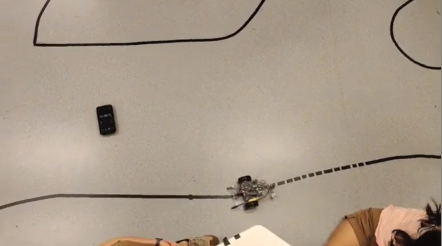
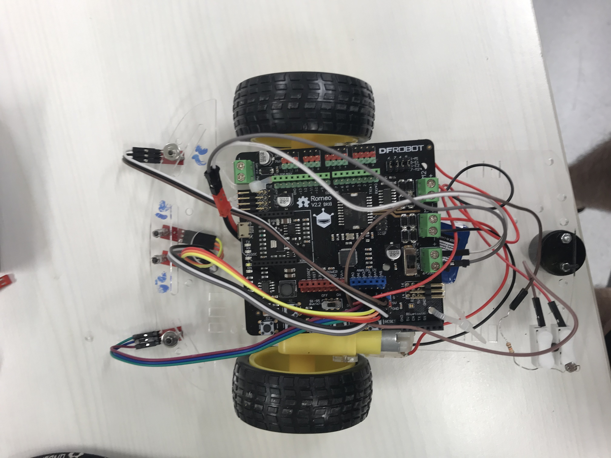

# PID Line Tracing Robot

  

 

Robot running our test circuit. Has at least 10 bends, one 90 degree right, one 90 degree left, and dotted line of at least 1cm width.

 

  

 

Features:
Light activated for launch (using LDR)

Romeo Board has inbuilt motor driver L298

4x Analog IR sensors

 

Group members :

Kenneth

Shu Lin

Xin yi

Ivan

Yi shen

